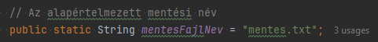
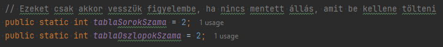
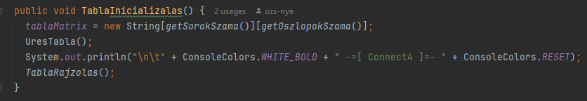
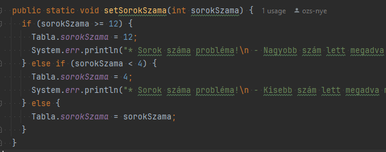
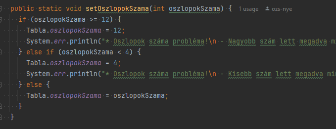
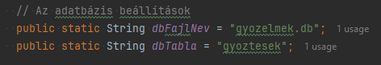

# Connect 4 játék (JAVA - console)
A Connetc4 (kétszemélyes) játék konzolos JAVA implementációja. Az alapszabály leírása: [Wikipedia: Connect Four.](https://hu.wikipedia.org/wiki/Connect_four)

Ezen változatban ember játszik gép ellen. *(Ez könnyen feloldható, amennyiben deaktiváljuk az automatikus korong lerakást.)*

## Feladat
A Nyíregyházi Egyetem - Programozási Technológiák (2024. őszi félév) [kurzusleírásban](docs/kurzusleiras.pdf)  foglaltak megvalósítása.

### A projekt fontosabb mappái, fájljai

- docs - Dokumentumok alapkönyvtára
- javadoc - Generált JavaDoc fájlok
- src/main/java/connect4 - A Connect4 forrásfáljai
- gyozelmek.db - SQLite3 adatbázis fájl a győzelmek számainak letárolására.
- pom.xml - Maven függőségi leíró

## Működés

### Az alkalmazás indítása paraméter nélkül

#### Létezik-e mentett állás?
Az alkalmazás paraméter nélküli indításakor megvizsgálja, hogy létezik-e, elérhető-e a **Main.java** metódusában beállított mentési fájl.

#### Mentett állás betöltése
Ha létezik, akkor megpróbálja betölteni, majd a tábla méretét automatikusan hozzá igazítja. Ekkor a játék a kimentett állástól folytatható. *(Ez minden esetben a felhasználói lépés.)*

#### Üres játéktér legenerálása

Ha nem található a meghatározott mentési fájl, akkor a játék a **Main.java** metódusában megadott sor és oszlop paraméterekkel legenerál egy üres játékteret, amiben az első lépés az emberi játékosé.

##### Hibás sor és oszlop értékek lekezelése
Amennyiben a megadott sorok és oszlopok száma kisebb vagy nagyobb a feladatban meghatározottaktól (4 <= Sorok száma <= Oszlopok száma <= 12), akkor az alkalmazás a legnagyobb adható értékkel helyettesíti ezeket a változókat.

[...]

#### Nyertes keresése és kihirdetése
Az alkalmazás mindaddig fut (rajzolja újra a táblát a lerakott korongokkal), amíg 4 azonos színű nem lesz megtalálható **egymás mellett**, illetve **átlósan**. 

A nyertes kihirdetésekor az alkalmazás a kapcsolt adatbázisban eggyel növeli az aktuális játékos nyeréseinek számát, majd ezt követően automatikusan kilép.

### Alkalmazás indítása paraméterrel ('hs')
Az alkalmazást lehetőség van 'hs' (értsd: HighScore) paraméterrel indítani.
Ekkor a kapcsolt adatbázisból kikéri a játékosok összesített nyerési számát, megjeleníti majd kilép.

Kapcsolt adatbázis paraméterei:

