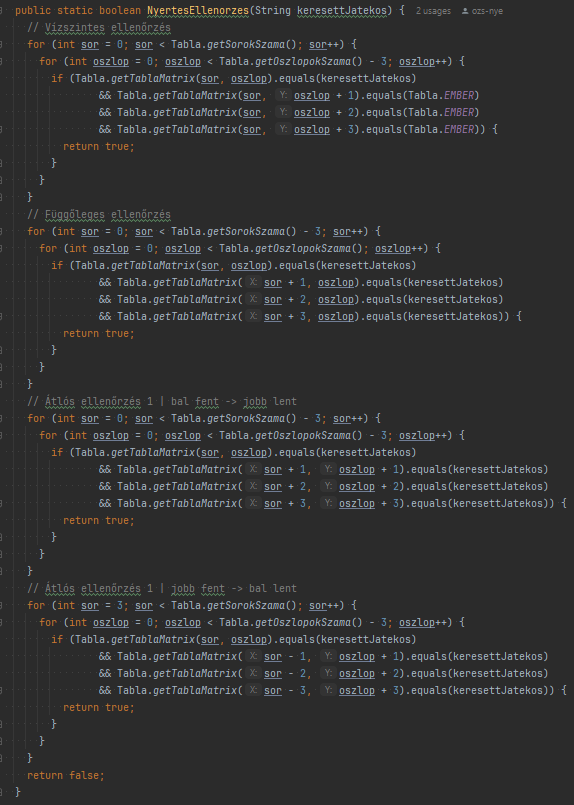

# Connect 4 játék (JAVA - console)
A Connetc4 (kétszemélyes) játék konzolos JAVA implementációja. Az alapszabály leírása: [Wikipedia: Connect Four.](https://hu.wikipedia.org/wiki/Connect_four)

Ezen változatban ember játszik gép ellen. *(Ez könnyen feloldható, amennyiben deaktiváljuk az automatikus korong lerakást.)*

## Tartalom
<!-- TOC -->
* [Connect 4 játék (JAVA - console)](#connect-4-játék-java---console)
  * [Tartalom](#tartalom)
  * [Feladat](#feladat)
    * [Feladat kivonat](#feladat-kivonat)
    * [A projekt fontosabb mappái, fájljai](#a-projekt-fontosabb-mappái-fájljai)
  * [Működés](#működés)
    * [Az alkalmazás indítása paraméter nélkül](#az-alkalmazás-indítása-paraméter-nélkül)
      * [Létezik-e mentett állás?](#létezik-e-mentett-állás)
      * [Mentett állás betöltése](#mentett-állás-betöltése)
      * [Üres játéktér legenerálása](#üres-játéktér-legenerálása)
        * [Hibás sor és oszlop értékek lekezelése](#hibás-sor-és-oszlop-értékek-lekezelése)
      * [Nyertes keresése és kihirdetése](#nyertes-keresése-és-kihirdetése)
    * [Alkalmazás indítása paraméterrel ('hs')](#alkalmazás-indítása-paraméterrel-hs)
  * [Az alkalmazás működési diagramja](#az-alkalmazás-működési-diagramja)
  * [Felhasznált külső forrás](#felhasznált-külső-forrás)
<!-- TOC -->

## Feladat
A Nyíregyházi Egyetem - Programozási Technológiák (2024. őszi félév) [kurzusleírásban](docs/kurzusleiras.pdf)  foglaltak megvalósítása.

### Feladat kivonat
- [X] N x M mérű tábla generálás (4 <= oszlopok száma <= sorok száma <= 12)
- [X] Induláskor üres tábla generálás
- [X] Ember (sárga) kezd, majd a Gép (piros) folytat
  - [X] Mindaddig váltják egymást a korong lerakásban, míg az egyik nem győz
  - [X] A gép az elérhető lehetőségek közül random helyre teszi le a korongot
- [X] Az a játékos nyer, amelyik egymás mellett (vízszintesen, függőlegesen, átlóban) el tud helyezni 4 azonos színű korongot
- [X] Publikus github repo alkalmazása az alkalmazás tárolására, megosztására (https://github.com/ozs-nye/connect4)
- [X] .gitignore fájl alkalmazása a feltölteni nem kívánt fájlok tiltásához
- [X] Maven projekt létrehozása, plugin-ek meghívása
  - [X] org.apache.maven.plugins.maven-jar-plugin
  - [X] org.apache.maven.plugins.maven-assembly-plugin
  - [X] org.jacoco.jacoco-maven-plugin
  - [X] org.apache.maven.plugins.maven-checkstyle-plugin
  - Külső függőségek:
    - [X] JUnit5
    - [X] Mockito
    - [X] Logback
- [X] Az alkalmazás teljesen végigjátszható
- [X] Induláskor ellenőrzi, hogy létezik-e mentett játékállás. Ha igen, betölti, az táblát automatikus méretezi, majd folytatja a játékot
- [X] Az alkalmazás a lényeges interakciókat tartalmazza
  - [X] Játék indítás
  - [X] Játéktér ki- és újrarajzolás
  - [X] Lépés fogadás a parancssoról
  - [X] Adott lépés vizsgálat (megfelelő, elfogadható, lerakható)
  - [X] Legutolsó lépés, játéktér megjelenítés
- [X] Egységtesztek
- [X] A nyert mérkőzések számának nyomon követése adatbázis kapcsolat segítségével (SQLite)
- [X] mvn clean install parancs használatakor hiba nélkül fordul és indul

### A projekt fontosabb mappái, fájljai

- docs - Dokumentumok és kiegészítők alapkönyvtára
- javadoc - Generált JavaDoc fájlok
- src/main/java/connect4 - A Connect4 forrásfáljai
- src/test/java/connect4/Csomagok - A Connect4 csomagjaihoz tartozó teszt fájljok
- connect4.pdf - Alapvető működési ábra az alkalmazás működésének bemutatására
- gyozelmek.db - SQLite3 adatbázis fájl a győzelmek számainak letárolására
- mentes.txt - Mentett játékállás. Ha törlésre kerül, akkor egy üres pálya kerül legenerálásra.
- pom.xml - Maven függőségi leíró

## Működés

### Az alkalmazás indítása paraméter nélkül

#### Létezik-e mentett állás?
Az alkalmazás paraméter nélküli indításakor megvizsgálja, hogy létezik-e, elérhető-e a **Main.java** metódusában beállított mentési fájl.

#### Mentett állás betöltése
Ha létezik elmentett játékállás, akkor megpróbálja betölteni, majd a tábla méretét <ins>**automatikusan**</ins> igazítja. Ekkor a játék a kimentett állástól folytatható. *(Ez minden esetben a felhasználói lépés.)*

#### Üres játéktér legenerálása

Ha nem található a meghatározott mentési fájl, akkor a játék a **Main.java** metódusában megadott sor és oszlop paraméterekkel legenerál egy üres játékteret, amiben az első lépés az emberi játékosé.

##### Hibás sor és oszlop értékek lekezelése
Amennyiben a megadott sorok és oszlopok száma kisebb vagy nagyobb a feladatban meghatározottaktól (4 <= Sorok száma <= Oszlopok száma <= 12), akkor az alkalmazás a legnagyobb adható értékkel helyettesíti ezeket a változókat.

[...]

#### Nyertes keresése és kihirdetése
Az alkalmazás mindaddig fut (rajzolja újra a táblát a lerakott korongokkal), amíg 4 azonos színű nem lesz megtalálható **egymás mellett**, illetve **átlósan**. 

A nyertes kihirdetésekor az alkalmazás a kapcsolt adatbázisban eggyel növeli az aktuális játékos nyeréseinek számát, majd ezt követően automatikusan kilép.

### Alkalmazás indítása paraméterrel ('hs')
Az alkalmazást lehetőség van 'hs' (értsd: HighScore) paraméterrel indítani.
Ekkor a kapcsolt adatbázisból kikéri a játékosok összesített nyerési számát, megjeleníti majd kilép.

Kapcsolt adatbázis paraméterei:

## Az alkalmazás működési diagramja

## Felhasznált külső forrás
- Konzolos szöveg színezés: [ConsoleColors](https://stackoverflow.com/questions/5762491/how-to-print-color-in-console-using-system-out-println)
- SQLite adatbázis kezelés: [SQLite JDBC Driver](https://github.com/xerial/sqlite-jdbc)
